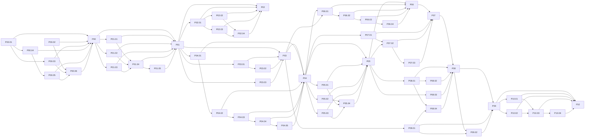

# Task dependency graph

Generated.

```mermaid
flowchart LR
  P00_01[P00.01] --> P00_03[P00.03]
  P00_01[P00.01] --> P00_04[P00.04]
  P00_04[P00.04] --> P00_05[P00.05]
  P00_02[P00.02] --> P00_06[P00.06]
  P00_03[P00.03] --> P00_06[P00.06]
  P00_05[P00.05] --> P00_06[P00.06]
  P00_01[P00.01] --> P00[P00]
  P00_02[P00.02] --> P00[P00]
  P00_03[P00.03] --> P00[P00]
  P00_04[P00.04] --> P00[P00]
  P00_05[P00.05] --> P00[P00]
  P00_06[P00.06] --> P00[P00]
  P00[P00] --> P01_01[P01.01]
  P00[P00] --> P01_02[P01.02]
  P00[P00] --> P01_03[P01.03]
  P01_01[P01.01] --> P01_04[P01.04]
  P01_02[P01.02] --> P01_04[P01.04]
  P01_03[P01.03] --> P01_04[P01.04]
  P01_04[P01.04] --> P01_05[P01.05]
  P00[P00] --> P01[P01]
  P01_01[P01.01] --> P01[P01]
  P01_02[P01.02] --> P01[P01]
  P01_03[P01.03] --> P01[P01]
  P01_04[P01.04] --> P01[P01]
  P01_05[P01.05] --> P01[P01]
  P01[P01] --> P02_01[P02.01]
  P02_01[P02.01] --> P02_02[P02.02]
  P02_01[P02.01] --> P02_03[P02.03]
  P02_02[P02.02] --> P02_04[P02.04]
  P02_03[P02.03] --> P02_04[P02.04]
  P01[P01] --> P02[P02]
  P02_01[P02.01] --> P02[P02]
  P02_02[P02.02] --> P02[P02]
  P02_03[P02.03] --> P02[P02]
  P02_04[P02.04] --> P02[P02]
  P01[P01] --> P03_01[P03.01]
  P03_01[P03.01] --> P03_02[P03.02]
  P01[P01] --> P03_03[P03.03]
  P01[P01] --> P03[P03]
  P03_01[P03.01] --> P03[P03]
  P03_02[P03.02] --> P03[P03]
  P03_03[P03.03] --> P03[P03]
  P01[P01] --> P04_01[P04.01]
  P04_01[P04.01] --> P04_02[P04.02]
  P04_02[P04.02] --> P04_03[P04.03]
  P04_03[P04.03] --> P04_04[P04.04]
  P04_04[P04.04] --> P04_05[P04.05]
  P03[P03] --> P04[P04]
  P04_01[P04.01] --> P04[P04]
  P04_02[P04.02] --> P04[P04]
  P04_03[P04.03] --> P04[P04]
  P04_04[P04.04] --> P04[P04]
  P04_05[P04.05] --> P04[P04]
  P04[P04] --> P05_01[P05.01]
  P04[P04] --> P05_02[P05.02]
  P04[P04] --> P05_03[P05.03]
  P05_02[P05.02] --> P05_04[P05.04]
  P05_01[P05.01] --> P05_04[P05.04]
  P05_03[P05.03] --> P05_04[P05.04]
  P04[P04] --> P05[P05]
  P05_01[P05.01] --> P05[P05]
  P05_02[P05.02] --> P05[P05]
  P05_03[P05.03] --> P05[P05]
  P05_04[P05.04] --> P05[P05]
  P04[P04] --> P06_01[P06.01]
  P03[P03] --> P06_01[P06.01]
  P06_01[P06.01] --> P06_02[P06.02]
  P06_02[P06.02] --> P06_03[P06.03]
  P06_03[P06.03] --> P06_04[P06.04]
  P05[P05] --> P06[P06]
  P06_01[P06.01] --> P06[P06]
  P06_02[P06.02] --> P06[P06]
  P06_03[P06.03] --> P06[P06]
  P06_04[P06.04] --> P06[P06]
  P04[P04] --> P07_01[P07.01]
  P07_01[P07.01] --> P07_02[P07.02]
  P05[P05] --> P07_02[P07.02]
  P07_02[P07.02] --> P07_03[P07.03]
  P06[P06] --> P07[P07]
  P07_01[P07.01] --> P07[P07]
  P07_02[P07.02] --> P07[P07]
  P07_03[P07.03] --> P07[P07]
  P05[P05] --> P08_01[P08.01]
  P08_01[P08.01] --> P08_02[P08.02]
  P05[P05] --> P08_03[P08.03]
  P08_01[P08.01] --> P08_04[P08.04]
  P09_01[P09.01] --> P08_04[P08.04]
  P07[P07] --> P08[P08]
  P08_01[P08.01] --> P08[P08]
  P08_02[P08.02] --> P08[P08]
  P08_03[P08.03] --> P08[P08]
  P08_04[P08.04] --> P08[P08]
  P03[P03] --> P09_01[P09.01]
  P08[P08] --> P09_02[P09.02]
  P09_01[P09.01] --> P09_02[P09.02]
  P08[P08] --> P09[P09]
  P09_01[P09.01] --> P09[P09]
  P09_02[P09.02] --> P09[P09]
  P09[P09] --> P10_01[P10.01]
  P09[P09] --> P10_02[P10.02]
  P10_01[P10.01] --> P10_03[P10.03]
  P10_02[P10.02] --> P10_03[P10.03]
  P10_03[P10.03] --> P10_04[P10.04]
  P09[P09] --> P10[P10]
  P10_01[P10.01] --> P10[P10]
  P10_02[P10.02] --> P10[P10]
  P10_03[P10.03] --> P10[P10]
  P10_04[P10.04] --> P10[P10]
```
